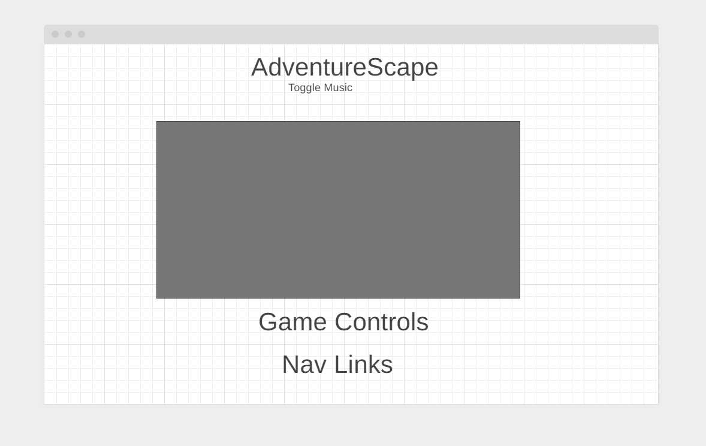

# [AdventureScape](https://mrizwan83.github.io/adventurescape/) Live Link
# Background

I was inspired by the games that I played during my childhood such as Runescape and Nintendo Games. For this project I designed a game where the main character starts off on an island and can move around the map, and while the player moves, the view follows the main character. There are npcs or opponents on the map that the main character can interact with and challenge to a fight.

## Demo 

# Gameplay

AdventureScape takes place on an Island where the Undead have Risen! All of the Neighbor's are being Overrun by the Undead and it is Your job to Eradicate Them! Help fight them off before they take over the Island. There is a Kill Counter and To Win You Must Reach 4 Kill Count. If You Lose a Fight Your Kill Count will decrease by 1, Win a fight and it goes up by 1. Goal is to reach 4 kill count. 

## [AdventureScape](https://mrizwan83.github.io/adventurescape/)

# Functionality & MVPs:

In { adventurescape }, users will be able to:

-{ to move freely in the map }
-{ to interact with npcs and challenge them  }
-{ initate fight scenes and gameplay to fight npc }
-{ turn music on or off }
-{ restart after win }

In addition, this project will include:

-{ A production README }
-{ Nav links }

# Wireframes:

-{ Nav links include links to this project's Github repo, my LinkedIn and the About info}
-{ Controls will have game instructions}
-{ Game instructions will be like 'a' to move left, 'd' to move right; etc.}

# Technologies, Libraries, APIs:

This project will be implemented with the following technologies:
-{Canvas API to render the game screen}
-{Webpack to bundle and transpile the source JavaScript code}
-{Vanilla DOM to handle user input events}
-{Gsock library to handle the fight scene}
-{Press Start 2p font}

## Implementation Timeline:

Friday Afternoon & Weekend: Setup project, including getting webpack up and running. 
Get canvas to show up on the screen, and spend time getting comfortable with the Canvas API. 

Monday: Dedicate this day toward implementing the underlying logic of AdventureScape.
Have blocks showing up as "characters" and have the functionality to move them on the screen.

Tuesday: If I didn't get to it already, get the player, npc, and boss to render, as well as the map.

Wednesday: Finish implementing user controls, and focus on styling, as well as implementing the different fight scenes and nav links. If time, start on bonuses.

Thursday: Deploy to GitHub pages. Finishing Touches.
